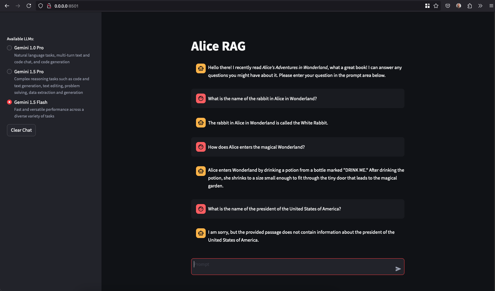

# Alice Retrieval-Augmented Generation (RAG)

Alice Retrieval-Augmented Generation (RAG) is a proof of concept application designed to answer queries about Alice’s Adventures in Wonderland, Lewis Carroll’s timeless classic. This innovative solution leverages the power of modern AI to combine the strengths of retrieval-based and generation-based approaches. By integrating a language model with a customized knowledge store, “Alice RAG” can accurately and efficiently retrieve information from the book and generate responses related to *Alice’s Adventures in Wonderland*.

This project showcases my ability to implement advanced AI techniques, containerization, CI/CD, documentation, and web-based interaction using Streamlit, all while adhering to best practices in software development and deployment.

