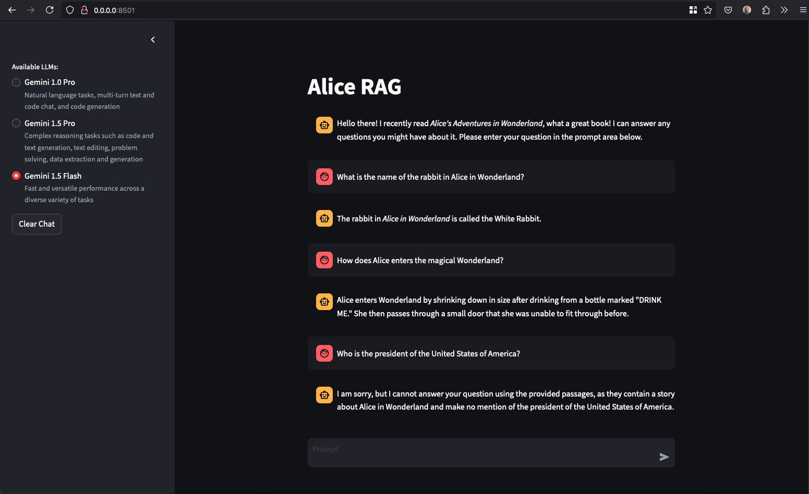

# Alice Retrieval-Augmented Generation (RAG)

Alice Retrieval-Augmented Generation (RAG) is a proof of concept application designed to answer queries about Alice’s Adventures in Wonderland, Lewis Carroll’s timeless classic. This innovative solution leverages the power of modern AI to combine the strengths of retrieval-based and generation-based approaches. By integrating a language model with a customized knowledge store, Alice RAG can accurately and efficiently retrieve information from the book and generate responses related to *Alice’s Adventures in Wonderland*.

This project showcases my ability to implement advanced AI techniques, containerization, CI/CD, documentation, infrastructure as code (IoC), and web-based interaction using Streamlit while adhering to best practices in software development and deployment.

## Running Locally

To run the image, you have to map port `8501` to a local port and set the `GEMINI_API_TOKEN` environment variable. You can obtain a Google Gemini token ([Google AI for Developers](https://ai.google.dev/pricing)), and there is a free tier that you can use to try the API.

```
docker run -p 8501:8501 -e GEMINI_API_TOKEN=$GEMINI_API_KEY pmiron/alice-rag-llm:latest
```
will launch a Streamlit application locally, i.e. at [http://0.0.0.0:8501](http://0.0.0.0:8501). Below a screenshot of an interaction with the application.



docker run -p 8501:8501 -e GEMINI_API_TOKEN=$GEMINI_API_KEY aliceragllm:latest