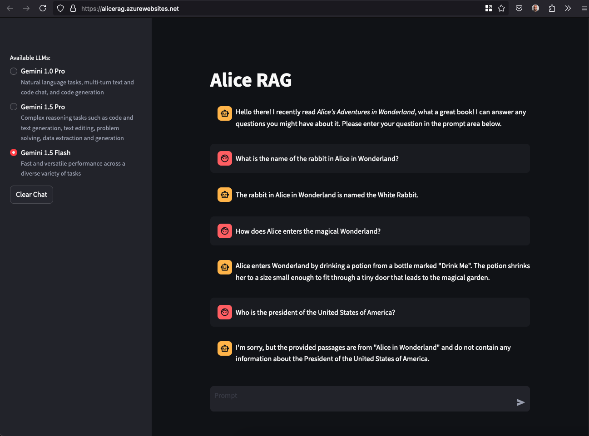

The `bicep/` folder contains the Infrastructure as Code (IaC) scripts needed to deploy the Alice RAG as an App Service in Azure. Below is an explanation of the initial requirements and the steps to set up the application.

While these steps would typically be integrated into the CI/CD pipeline, to avoid Gemini API and Azure costs, the `launch.sh` script must be executed manually.

1. Obtain an Azure account. New accounts receive a $200 credit and access to the free tier. For more details, visit [Azure](https://azure.microsoft.com/en-us/free).

2. Install the Azure CLI using [brew](https://brew.sh/) on macOS:

```shell
brew install az
```
or using your favorite Linux package manager.

3. Log in to Azure CLI: Open your terminal and log in to your Azure account using the Azure CLI.

```shell
az login
```
this will open a web browser where you can enter your Azure credentials.

4. Create a Resource Group where the resources will be deployed. Here the location is set to eastern USA.

```shell
# create resource group
az group create --location eastus --name demo-app
```

5. Create the container registry by executing the Bicep template from `bicep/infra/`.

```shell
# create container registry
az deployment group create \
    --resource-group demo-app \
    --template-file ./acr/main.bicep \
    --parameters containerRegistryName=aliceragllm
```

6. Login to Azure Container Registry (ACR), to be able to push the Docker image.

```shell
az acr login -n aliceragllm
```

7. Build the image (or pull the latest from DockerHub) and push it to ACR.

```shell
# retrieve, tag, push the image
docker pull --platform linux/amd64 pmiron/alice-rag-llm:latest
docker tag pmiron/alice-rag-llm:latest aliceragllm.azurecr.io/alice-rag-llm:latest
docker push aliceragllm.azurecr.io/alice-rag-llm:latest
```

8. Finally, deploy the application by executing the Bicep template from `bicep/app/`. This will create the App Service, App Service Plan, and assign the role. *Note*: by default, the app is publicly accessible (`publicNetworkAccess: 'Enabled'`). To avoid extra costs, stop the App Service from the console when not in use.

```shell
# deploy app
az deployment group create \
    --resource-group demo-app \
    --template-file ./app/main.bicep \
    --parameters \
        appServiceName=alicerag \
        containerRegistryName=aliceragllm \
        dockerImageNameTag=alice-rag-llm:latest \
        geminiAPI=$GEMINI_API_KEY
```

